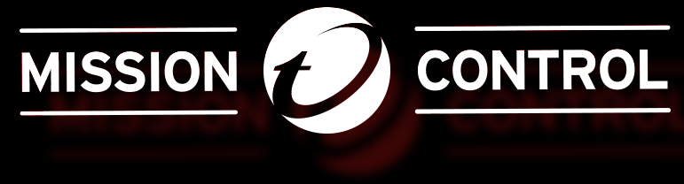
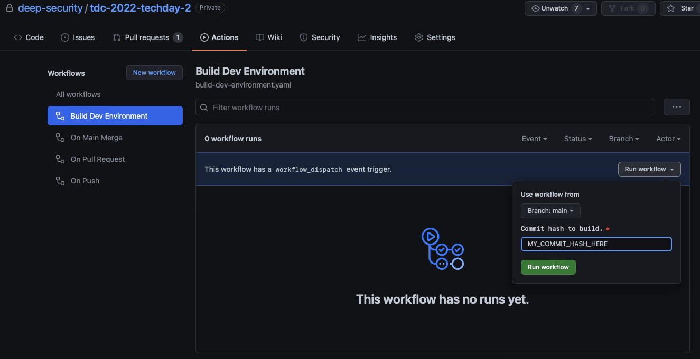
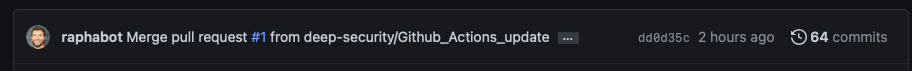
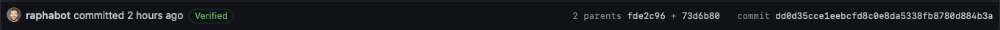

# Tech Day 2022 II - AKA Summer Tech Day
> You DO NOT TALK about ~~Fight Club~~ Tech Day building.

Centralized repository for Tech Day 2022 II. It contains everything to quick-start your challenge development and a guide on how to submit it for approval.

This repository is not intended towards those that just want to *run* a challenge. This is for buiders *only*. 

## Wiki
Before you begin work on your challenge, you need to read the Build Guide that is part of the wiki [Build Guide](https://github.com/deep-security/tdc-2022-techday-2/wiki).  This will help you craft a better challenge.  The Style Guide will be used later when you create the wording for your challenge.

## Developing your own challenge

First, clone it!

```shell
git clone https://github.com/deep-security/tdc-2022-techday-2.git
cd tdc-2022-techday-2/
```

Make a copy the content of the `example` folder insisde the `challenges` and paste it to your respective challenge folder to bootstrap your challenge development. 

Also, you are going to find different folders and files in this repo. Let's talk go over them. 

### **folder root**

* `sync.sh` - This script will syncronize your local challenge to an S3 bucket. Optionally pass an AWS profile as parameter.
Example: `./sync.sh BUCKET_NAME [AWS_PROFILE]`

* `testDeployment.sh` - This script will syncronize your local challenge to an S3 bucket *and* deploy it in the same account for testing.
Example: `./testDeployment.sh BUCKET_NAME STACK_NAME [AWS_PROFILE]`

### **infra**

You are recommended to **NOT** change files in this folder. There you'll find ready-to-use templates for `Apex One`, `Deep Security Manager`, `AWS EKS` and `AWS VPC`. These are provided to you as a base for your challenges. 

### **utils**

You are recommended to **NOT** change files in this folder. There you'll find useful ready-to-use templates, such as `copyzips`, `MissionControlChecker` and `RandomString`, and scripts, such as `vend.sh`. Each template folder includes its own README.md.

* `copyzips` - A Custom Resource that copy Zips (or any files, really) between buckets. Useful to copy Zips with Lambda function code across regions.

* `MissionControlChecker` - Creates a Lambda that is callebable by Mission Control, interfacing with it and the challenges in order to execute specific functions.

* `RandomString` - Generates random strings. Useful to generate unique passwords.

* `vend.sh` - This script will [create an environment using Vending Machine](#create-a-new-environment-from-your-last-commit), based on the code in the latest upstream commit for your locally checked-out branch. You can pass in the `--watch` flag to watch the output in your terminal and return your Vending Machine credentials.

### **challenges**

This is the folder where you should add your own challenges. You'll find the `example` folder inside of it as an example of what your structure should look like. Inside the `example` folder you'll finde the required structure approach, as below:

* `lambda` - Any Lambda function that belongs to this challenge, should live in its own folder inside of the `lambda` folder. 

* `scripts` - If this challange requires the use of custom scripts inside of EC2 instances, they should live here and be copied at boot time to the instances.

* `templates` - Any and all CloudFormation template related to the challenge should live in this folder. It already contains some CloudFormation templates that you can use as example. This nomeclature is highly recommended.

### **templates**

Last but not least, this is the core folder for the entire challenge. There are multiple files that *are made to be edited by the team*. You can for sure submit your changes to it, but it will be target of greater scrutinity to make sure it won't affect other challenges. Let's go over each one of them:

* `main.template` - This is the main template, that connects all pieces together for day 1. You'll probably need to instantiate your challenge day 1 stack here.

* `day2_main.template.yaml` - Same as above, but for day 2 resouces that can be created ahead of time.

* `entrypoint_main_with_keypair.template.yaml` - [DEPRECATED] A way to kickoff the main template passing 0 parameters and making sure it will create a keypair in case the main template needs it. You probably don't need to touch this file.

* `entrypoint_main.template.yaml` - A way to kickoff the main template passing 0 parameters. You probably don't need to touch this file.

* `player.template` - IAM stack. Make sure to add your required (and nothing else) permissions to it.

* `service_catalog_portfolio.template` - Instantiates a new Service Catalog Portlofio and associates it to the user. You probably don't need to touch it.

* `wrinkles_trigger.template` - Template triggered by Wrinkles. It will create everything that is day2 and **cannot** be created ahead of time.


## **Contributing**

This repo is following the [Github Flow](https://guides.github.com/introduction/flow/). This means that:
* A build from the main branch should always work
* The main branch is blocked for commits other than via a Pull Request
* PRs will require at least two approvals in order to be accepted
* A new challenge requires a new folder inside of `challenge` folder
* Every challenge folder needs to have at least 2 folders: `templates` and `scripts`
* Main branch is synced automatically with the proper S3 bucket.

## **Testing and Code Review**

**Testing your own contribution is mandatory**.

### **Create a new environment from your last commit**

Cool. You believe you have some code ready to be merged into main. Want to make sure it works in our environment first? You can create an environment using Vending Machine trough an Actions workflow. You can do this via the [`vend.sh` script](#utils), or through the Github interface:

To test using the Github interface, go to the `Actions` tab, select `Build Dev Environment` in the left side, click the `Run workflow` dropdown button, leave the branch as it is and enter your commit id in the textbox. Click `Run workflow` to start the creation of a new environment.



Not sure how to find your commit id? Go to your branch in github(below) and click the hash next to how long ago that code was commited. 



This will bring you to a new screen, with the entire hash, as below. That is the hash that you need to create your own environment.



There will be some minor automatic testing in PRs, such as a CloudFormation linter. It is required that your code pass these tests in order to have your code merged into main branch. Also, soon a PR will automatically generate an environment in Vending Machine so you can test with a TechDay-like environment.

### Pull Request

Ready to PR? Awesome. Go ahead and do so. This will automatically create a new environment using vending machine that both you and code reviewers are going to be able to use. The next step will be **code review**. During this process, other Tech Day staff and builders will meticulously go over your code, ask (tons of) questions and make recommendations for improvement. Be ready to act and discuss on those. If at least 2 members approve your change, it will be merged to main and officially be part of Tech Day's code. Well done!

## Licensing

You DO NOT TALK about ~~Fight Club~~ Tech Day bulding.
