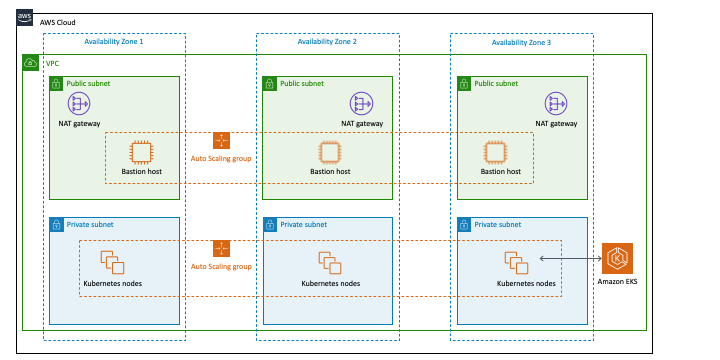

Deploying this Quick Start for a new virtual private cloud (VPC) with default parameters builds the following Amazon EKS environment in the AWS Cloud.

[#architecture1]
.Quick Start architecture for _{partner-product-name}_ on AWS
[link=images/architecture_diagram.png]

The Quick Start sets up the following:

* A highly available architecture that spans three Availability Zones.*
* A VPC configured with public and private subnets, according to AWS best practices, to provide you with your own virtual network on AWS.*
* In the public subnets, managed NAT gateways to allow outbound internet access for resources in the private subnets.*
* In one public subnet, a Linux bastion host in an Auto Scaling group to allow inbound Secure Shell (SSH) access to Amazon Elastic Compute Cloud (Amazon EC2) instances in private subnets. The bastion host is also configured with the Kubernetes `kubectl` command line interface (CLI) for managing the Kubernetes cluster.
* An Amazon EKS cluster, which creates the Kubernetes control plane.
* In the private subnets, a group of Kubernetes nodes.

+++*+++ The template that deploys the Quick Start into an existing VPC skips the components marked by asterisks and prompts you for your existing VPC configuration.
